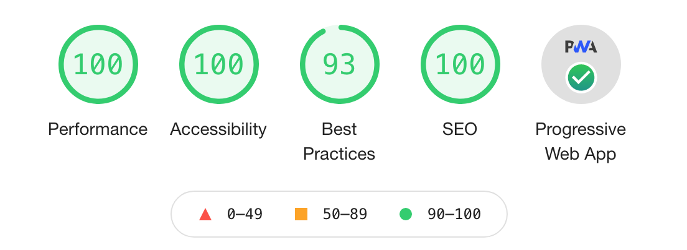
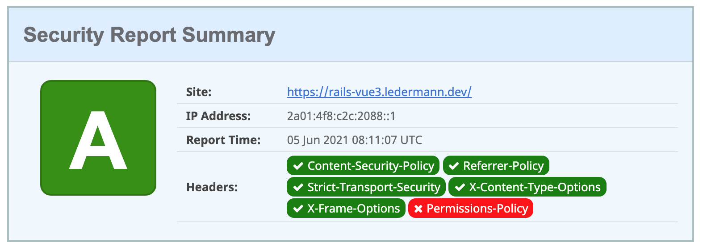
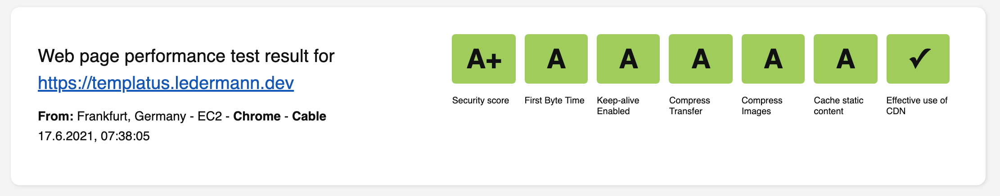
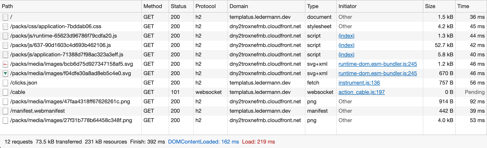

# README

Templatus is an opinionated template for web applications with Ruby on Rails using Vue.js on the frontend. It simplifies the process of setting up a new application while following best practices.

Live demo available at https://templatus.ledermann.dev

## Technology stack

- Ruby 3
- Ruby on Rails 6.1
- Webpacker 6 (still in beta, but this allows using Webpack 5)
- ActionCable (for WebSocket communication)
- PostgreSQL (for using as SQL database)
- Sidekiq (for background processing)
- Redis (for Caching, ActionCable and Sidekiq)
- Vue 3 (as frontend framework)
- Vue Router (for frontend routing)
- Vuex (for frontend state management)
- Tailwind CSS 2 (to not have to write CSS at all)
- HeadlessUI (unstyled, fully accessible UI components designed to integrate with Tailwind CSS)
- HeroIcons (for SVG icons as Vue components)
- RSpec (for Ruby testing)
- RuboCop (for Ruby static code analysis)
- TypeScript (for writing better JavaScript)
- Jest (for JavaScript testing)
- Honeybadger.io (for error tracking in Ruby and JavaScript)
- Lograge (for single-line logging)
- Docker (for production deployment, NOT for development)
- Puma-dev (for using https in development)
- Foreman (for starting up the application locally)
- dotenv (for configuration by using ENV variables)

## Features

- Deployment using an optimized Docker image based on Alpine Linux
- Ready for serving assets via CDN like CloudFront
- Ready for PWA (manifest, service-worker)
- Gzip compression of all dynamic responses (e.g. JSON) using Rack::Deflater
- JS Code splitting (separate vendor code from application code)
- Fine-tuned Content Security Policy (CSP)
- Uses GitHub Actions for testing, linting and building Docker image
- Visual Studio Code: Autoformat JS and Ruby code using Prettier

## Metrics

This template is developed with optimized performance and security in mind. The following benchmarks are
performed against the demo installation on production. It uses an inexpensive virtual server on the [Hetzner Cloud](https://www.hetzner.com/de/cloud) behind a [Traefik](https://traefik.io/traefik/) setup.

### Lighthouse site performance

100% in nearly all categories.



Why not 100% in _Best practice_ category? This is a [bug in Lighthouse](https://github.com/GoogleChrome/lighthouse/issues/11862), because Lighthouse first injects inline styles and then whines about a CSP warning.

### Secure headers



https://securityheaders.com/?q=templatus.ledermann.dev&followRedirects=on

What's the red _Permissions-Policy_ badge? This seems to be fixed with one of the nexts Rails update:
https://github.com/rails/rails/pull/41994

### Mozilla Observatory


https://observatory.mozilla.org/analyze/templatus.ledermann.dev

Why is there a failing test? It's about missing [Subresource Integrity](https://infosec.mozilla.org/guidelines/web_security#subresource-integrity), which is currently not supported by Webpacker. There is a [stale issue](https://github.com/rails/webpacker/issues/323) about it, I don't expect a fix in the near future.

### WebPageTest



https://webpagetest.org/result/210617_BiDcHH_d4cdb2af33ac2a7a9e4b66908ee3002f/

### GTmetrix


https://gtmetrix.com/reports/templatus.ledermann.dev/PR4PpigG/

### Check-your-website


https://check-your-website.server-daten.de/?q=templatus.ledermann.dev

### JavaScript size

146 KB of compiled JavaScript (minified, uncompressed). The largest parts are:

- Vue.js + Vue Router + Vuex (83 KB)
- Honeybadger (20 KB)
- ActionCable (10 KB)

```
RAILS_ENV=production SECRET_KEY_BASE=temp bin/rails webpacker:clobber webpacker:compile
Compiling...
Compiled all packs in /Users/ledermann/Projects/templatus/public/packs

warn - You have enabled the JIT engine which is currently in preview.
warn - Preview features are not covered by semver, may introduce breaking changes, and can change at any time.

assets by path media/images/ 52.6 KiB
  assets by chunk 47.7 KiB (auxiliary name: application) 9 assets
  assets by path media/images/*.gz 2.64 KiB 3 assets
  assets by path media/images/*.br 2.25 KiB
    asset media/images/ef0c1c6c92c1b5e887fc.ico.br 1.25 KiB [emitted] [immutable] [compressed]
    asset media/images/bcb6d75d927347158af5.svg.br 796 bytes [emitted] [immutable] [compressed]
    asset media/images/f04dfe30a8ad8eb5c4e0.svg.br 224 bytes [emitted] [immutable] [compressed]
assets by path js/*.js 146 KiB
  asset js/382-3925f39836c3694c7261.js 126 KiB [emitted] [immutable] [minimized] (id hint: vendors) 4 related assets
  asset js/application-9afb94f60781037266b6.js 18.5 KiB [emitted] [immutable] [minimized] (name: application) 3 related assets
  asset js/runtime-92e429d6a623e6028354.js 1.39 KiB [emitted] [immutable] [minimized] (name: runtime) 3 related assets
asset css/application-bfd2d636.css 17.9 KiB [emitted] [immutable] [minimized] (name: application) 3 related assets
asset manifest.json 3.79 KiB [emitted] 2 related assets
Entrypoint application 164 KiB (272 KiB) = js/runtime-92e429d6a623e6028354.js 1.39 KiB js/382-3925f39836c3694c7261.js 126 KiB css/application-bfd2d636.css 17.9 KiB js/application-9afb94f60781037266b6.js 18.5 KiB 13 auxiliary assets
orphan modules 186 KiB [orphan] 296 modules
runtime modules 3.35 KiB 7 modules
code generated modules 726 KiB (javascript) 47.7 KiB (asset) 27.8 KiB (css/mini-extract) [code generated]
  cacheable modules 726 KiB (javascript) 47.7 KiB (asset)
    javascript modules 726 KiB
      modules by path ./node_modules/@vue/ 403 KiB 4 modules
    modules by path ./app/packs/images/ 378 bytes (javascript) 47.7 KiB (asset)
      optional modules 294 bytes (javascript) 45.4 KiB (asset) [optional] 7 modules
      modules by path ./app/packs/images/*.svg 84 bytes (javascript) 2.33 KiB (asset)
        ./app/packs/images/rails.svg 42 bytes (javascript) 1.96 KiB (asset) [built] [code generated]
        ./app/packs/images/vue.svg 42 bytes (javascript) 375 bytes (asset) [built] [code generated]
  ./app/packs/images/ sync ^\.\/.*$ 378 bytes [built] [code generated]
  css ./node_modules/css-loader/dist/cjs.js??clonedRuleSet-3.use[1]!./node_modules/postcss-loader/dist/cjs.js??clonedRuleSet-3.use[2]!./app/packs/stylesheets/application.css 27.8 KiB [code generated]
webpack 5.40.0 compiled successfully in 6010 ms
```

### Network transfer

Small footprint: The demo application transfers only 62Kb of data on the first visit.



### Docker build time

With multi-stage building and using [DockerRailsBase](https://github.com/ledermann/docker-rails-base) the build of the Docker image takes very little time. Currently the build job requires about 1,5 minutes on GitHub Actions (see https://github.com/.ledermann/templatus/actions)

### Docker image size

The Docker image is based on Alpine Linux and is optimized for minimal size (currently 108 MB uncompressed disk size). It includes just the bare minimal - no unneeded Node.js, just the compiled assets, no tests.

```
REPOSITORY                     TAG       IMAGE ID       CREATED       SIZE
ghcr.io/ledermann/templatus    latest    4a7e6df71220   2 hours ago   108MB
```

## Development installation

1. Clone the repo locally:

```bash
git clone git@github.com:ledermann/templatus.git
cd templatus
```

2. Install PostgreSQL, Redis and puma-dev (if not already present). On a Mac with HomeBrew, run this to install from the `Brewfile`:

```bash
brew bundle
```

3. Install and set up [puma-dev](https://github.com/puma/puma-dev) to use HTTPS for both the application and `webpack-dev-server`. Do this on macOS:

```bash
sudo puma-dev -setup
puma-dev -install
puma-dev link

# Use https in development and load webpack from subdomain
# https://github.com/puma/puma-dev#webpack-dev-server
echo 3035 > ~/.puma-dev/webpack.templatus
```

4. Setup the application to install gems and NPM packages and create the database:

```bash
bin/setup
```

5. Start the application (and webpack-dev-server) locally:

```bash
foreman start
```

Then you can open https://templatus.test in your browser.

## Running tests

Run Ruby tests:

```
bin/rspec
open coverage/index.html
```

Run RuboCop:

```
bin/rubocop
```

Lint JavaScript:

```
bin/yarn lint
```

Run JavaScript tests:

```
bin/yarn test
```

## Deployment

```
docker network create public
docker-compose up
```
